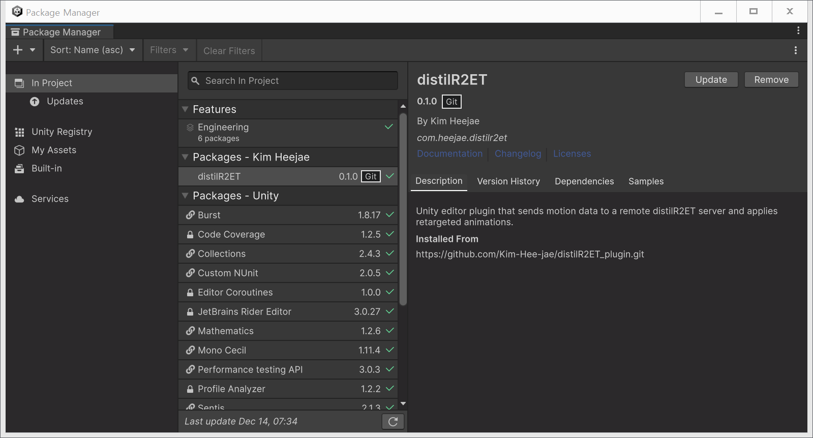
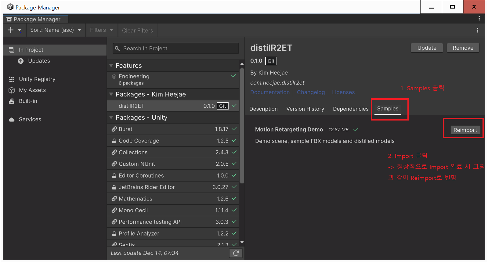
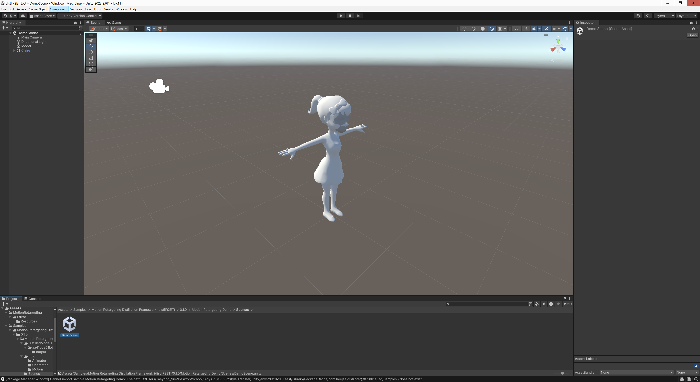
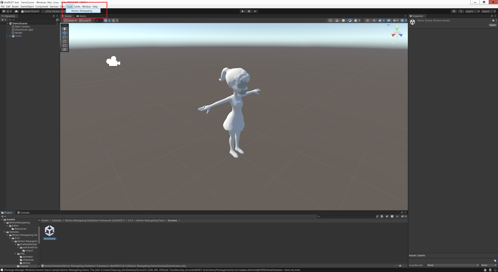
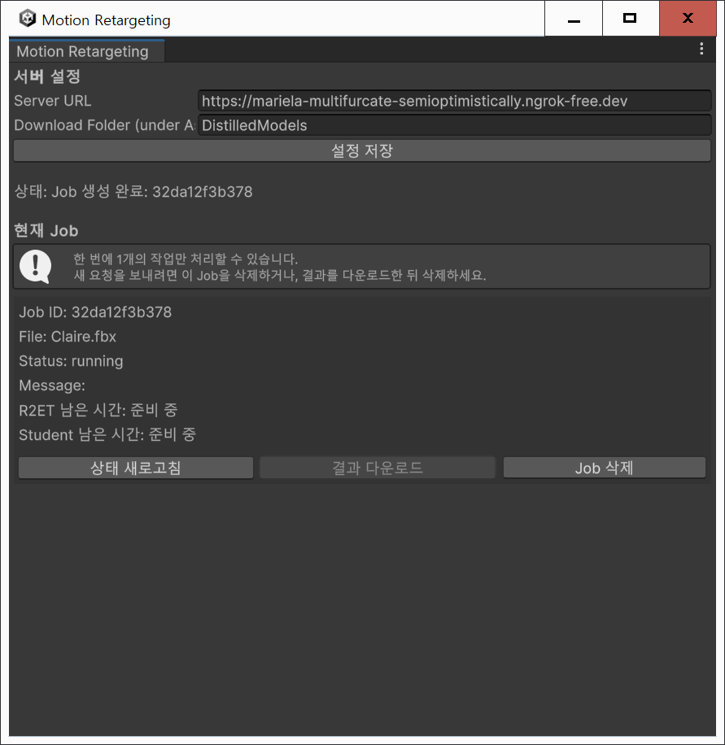
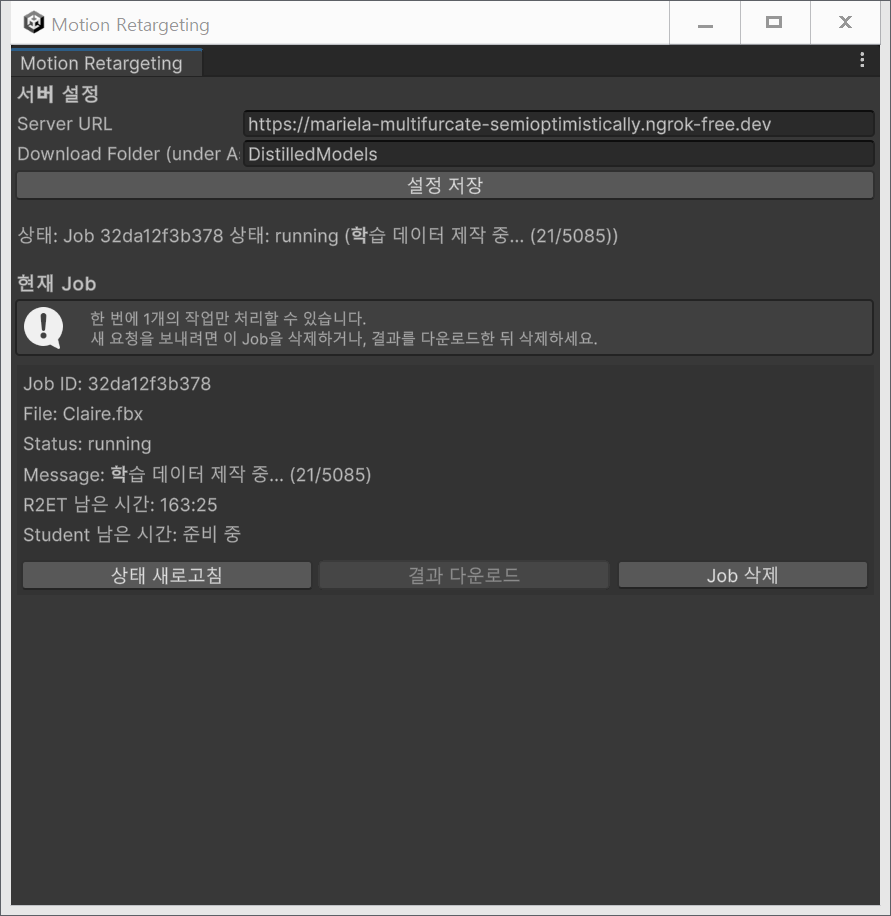
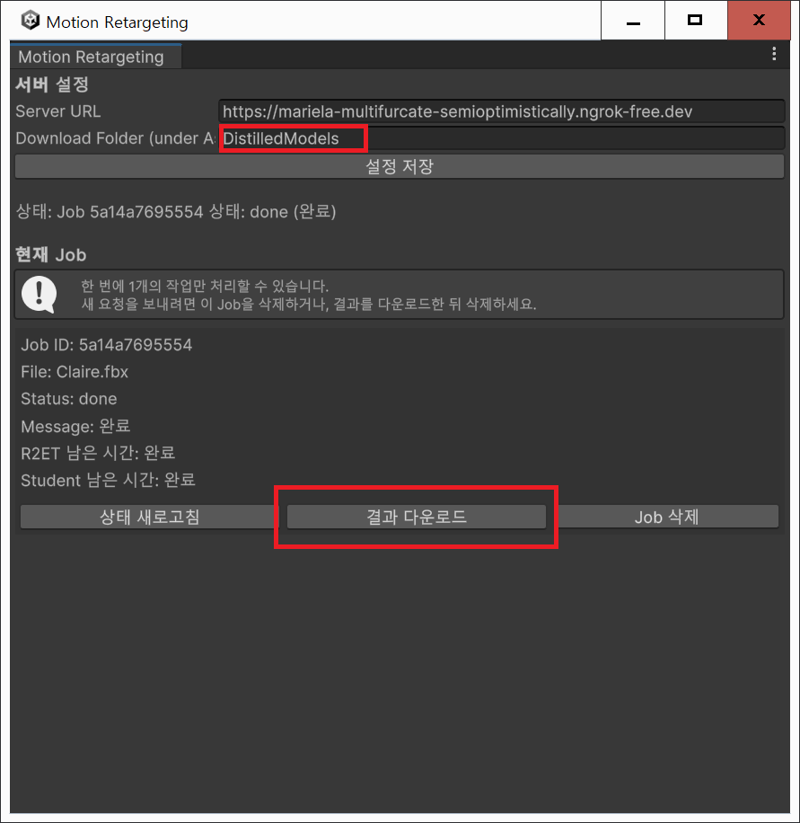
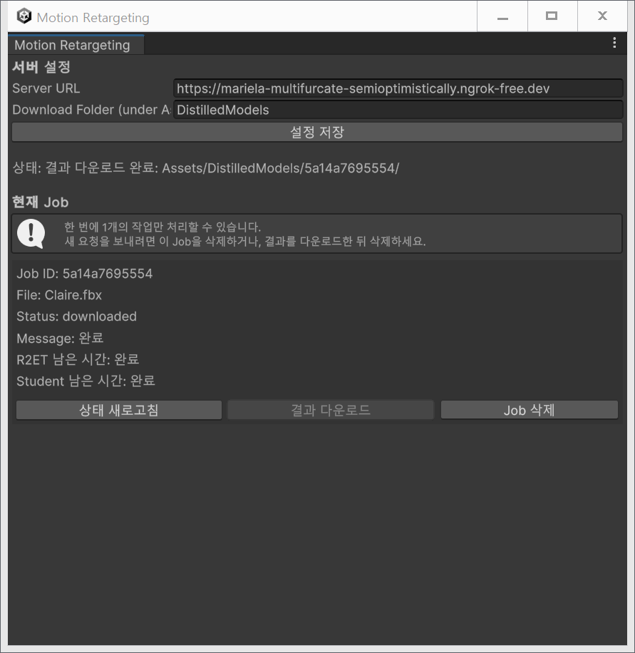

# distilR²ET – Unity 모션 리타게팅 플러그인

> **distilR²ET 기반 경량 모션 리타게팅 모델 제공 Unity Editor 플러그인**  
> 서버(FastAPI)는 외부에서 실행되며,  
> 본 플러그인은 Unity 내부에서 **모션 업로드 → Job 관리 → 결과 다운로드 → Sentis 실행**을 담당한다.

---

## ✨ 주요 기능

- Unity Editor 내에서 동작하는 경량 모션 리타게팅 모델 다운로드 파이프라인
- FBX 업로드 → 서버에서 모델 학습 → distilR²ET ONNX 모델 자동 다운로드
- FBX 업로드 후 Unity 종료 가능
- Unity Sentis 기반 런타임 추론
- Job 기반 비동기 처리
- Demo Scene 및 샘플 FBX 제공

---

## 📦 플러그인 설치

### Git URL을 통한 설치

1. Unity 실행
2. **Window → Package Manager**
3. 좌측 상단 **`+` → Add package from git URL…**
4. 아래 URL 입력

```text
https://github.com/Kim-Hee-jae/distilR2ET_plugin.git
```

---

### 설치 완료 확인

설치가 정상적으로 완료되면 Package Manager에 다음과 같이 표시된다.

- 패키지 이름: **distilR2ET**
- 버전: **0.1.0 (Git)**
- 제작자: **Kim Heejae**
- Samples 탭에서 Demo 확인 가능



---

## 🧪 Demo Scene 가져오기

1. **Package Manager**에서 `distilR2ET` 패키지 선택
2. **Samples** 탭 클릭
3. **Motion Retargeting Demo → Import**



---

## ▶️ Demo Scene 실행

```text
Assets/Samples/distilR2ET/0.1.0/Motion Retargeting Demo/Scenes/DemoScene.unity
```



Demo Scene에는 다음이 미리 구성되어 있다.

- Source 모션
- Target 캐릭터
- distilR²ET 리타게팅 컴포넌트

---

## 🛠️ 플러그인 실행 방법

```text
Tools → Motion Retargeting
```



---

## Motion Retargeting 플러그인 창

플러그인을 열면 기본적으로 아래와 같은 창이 나타난다.


### 서버 설정

- **Server URL**  
  추후 다른 Teacher 모델을 사용하는 서버를 개설할 가능성을 고려해 변경 가능하도록 설계되었다.  
  **현재 버전에서는 Server URL을 변경하면 정상적으로 동작하지 않으므로 수정하지 말 것.**

- **Download Folder (under Assets root)**  
  `Assets` 폴더를 기준으로 이후 작성한 경로에 결과 ONNX 모델이 다운로드된다.  
  변경 후 **설정 저장** 버튼을 눌러 기본값으로 저장 가능.

---

## FBX 입력 안내 (중요)

Demo Sample FBX 경로:

```text
Assets/Samples/distilR2ET/0.1.0/Motion Retargeting Demo/FBX/Character/Claire.fbx
```

- 위 경로의 FBX 파일을 Target FBX 항목에 지정하여 바로 작업 요청을 해볼 수 있다.

### ⚠️ FBX 사용 시 주의 사항

- FBX에 **여러 Mesh가 포함된 경우, Body Mesh가 반드시 첫 번째**여야 한다.
- 그렇지 않으면 정상적인 모델 학습이 어렵거나 에러가 발생할 수 있다.

---

## ▶️ Job 실행 중 상태




- 남은 시간은 **분:초** 형식으로 표시
- **동시에 하나의 Job만 실행 가능**
- 다른 작업을 하려면 기존 Job 삭제 필요
- **학습(서버 추론) 도중 Unity Editor를 종료해도 Job은 서버에서 계속 진행되며,  
  이후 Unity를 다시 실행해 상태를 확인하고 완료된 경우 결과를 다운로드할 수 있다.**

---

## ✅ Job 실행 완료 및 결과 확인




결과는 아래 경로에서 확인 가능:

```text
Assets/DistilledModels/<JobID>/
```

자세한 사용법은 **결과 다운로드 시 포함된 README.md** 참고.

---

## ❌ 에러 발생 시


- **Job 삭제 → 팝업에서 삭제 선택 → 재요청**

---

## 📁 Demo Import 후 전체 구조 예시

```text
Assets/
├─ Samples/
│  └─ distilR2ET/
│     └─ 0.1.0/
│        └─ Motion Retargeting Demo/
│           ├─ Scenes/          # 데모 실행용 Scene
│           ├─ FBX/             # 샘플 FBX 캐릭터 및 모션
│           └─ DistilledModels/ # 데모용 distilR²ET 모델
│
├─ DistilledModels/
│  └─ <JobID>/                  # Job 단위 결과 폴더
│     └─ output/
│        └─ distilr2et.onnx     # 리타게팅 결과 ONNX 모델
│
├─ MotionRetargeting/
│  └─ Editor/Resources/
│     └─ MotionRetargetingConfig.asset
│                               # 플러그인 설정 파일
│
└─ MotionRetargetingJobs.json   # Job 상태 및 기록 관리 파일
```

---

## ⚠️ 주의 사항

- 본 플러그인은 서버를 포함하지 않는다
- FastAPI 서버는 별도 실행 필요
- Windows에서는 경로 길이를 짧게 유지 권장 (경로 길이 제한 피하기 위해)

---

## ✉️ 문의

- 제작자: **김희재**
- GitHub: https://github.com/Kim-Hee-jae
